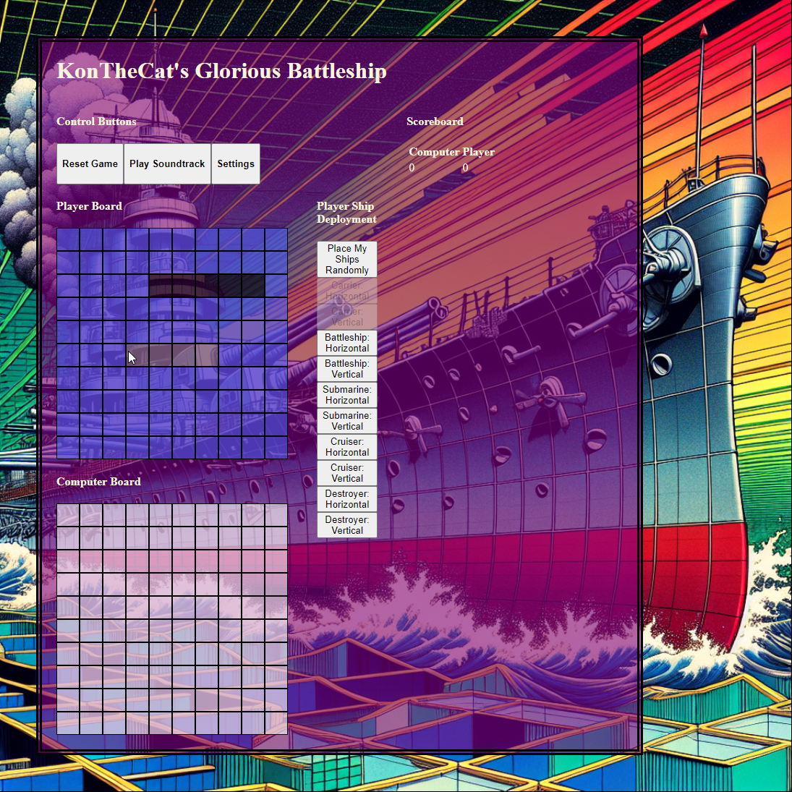
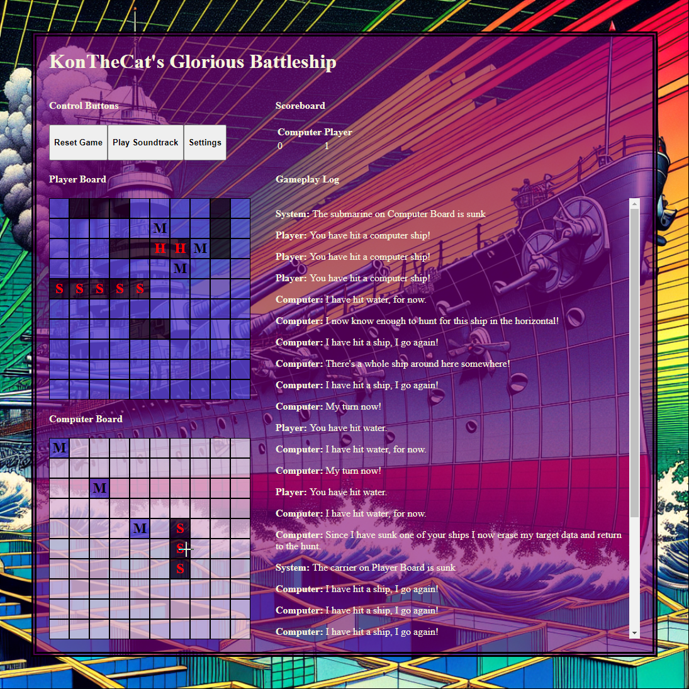

# Intro

Just your regular game of Battleship.

Play the game here: [KonTheCat's Battleship](https://battleship.konthecat.com/)

# Rules

1. Ships must be separated by at least 1 cell in every direction.
2. If you or the computer hit, you or the computer get to shoot again, until there is a miss. 
3. Player must deploy all of their ships, either manually or randomly, before they can play.

# Notes about difficulty and "AI"

The following difficulties exist, they are cumulative, so each higher difficulty includes all of the elements of the previous difficulties. On all difficulty levels the computer player recognizes when it hits a ship and prioritizes it's destruction. 

1. Easy - Computer shoots randomly, including at cells that due to deployment rules could not have a ship.
2. Medium - Computer player takes into account cells that could not have a ship due to deployment rules.
3. Hard - Computer player computes the sum of vertical and horizontal free space for every cell and randomly picks a cell from the top 25% of cells ordered by that metric.
4. Cheating - All cells containing ship parts that have not been hit yet are added to the 25% set used by Hard difficulty. 

# Screenshots

### Ship deployment

### Gameplay

# Technologies used

Mostly JavaScript, with CSS and HTML doing mostly static work that it did not make sense to me to do in JavaScript.

# Future Enhancements
1. Special abilities. 
2. Dynamic board sizing, both relative to the window and being able to have boards other than a 10 by 10.

# Credits

Soundtrack: ["Girls Und Panzer OST: Senshadou Koushinkyoku! Panzer Vor!"](https://www.youtube.com/watch?v=val5LZ-YURo)